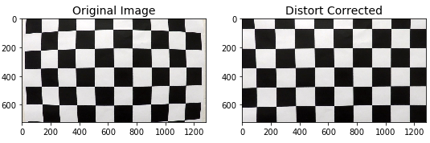
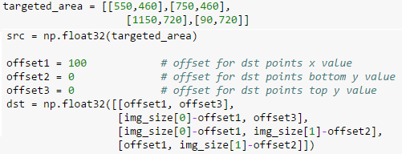
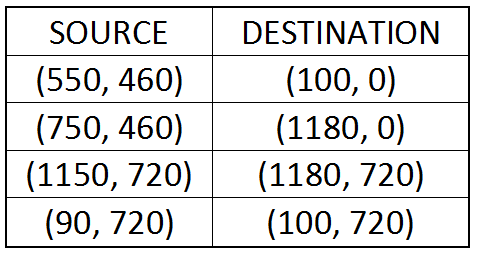
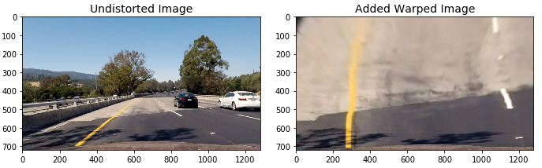
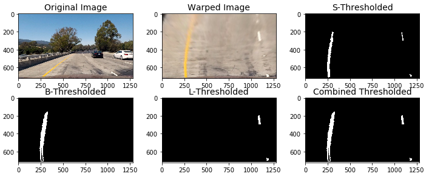
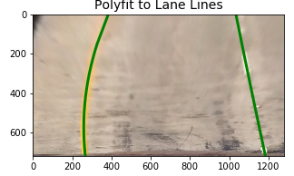
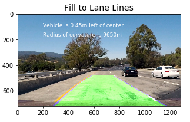

# P4 - Advanced Lane Finding

## Udacity / Self-Driving Car Nanodegree / Term1

The Purpose of this project is to compose a pipeline to process lane lines, locate lane lines and find radius of curvature of the road with the provided video. The final output will have the sliding window indicating lanes overlaying the video.

### Advanced Lane Finding Project

The goals / steps of this project are the following:

* Compute the camera calibration matrix and distortion coefficients given a set of chessboard images.
* Apply a distortion correction to raw images.
* Use color transforms, gradients, etc., to create a thresholded binary image.
* Apply a perspective transform to rectify binary image ("birds-eye view").
* Detect lane pixels and fit to find the lane boundary.
* Determine the curvature of the lane and vehicle position with respect to center.
* Warp the detected lane boundaries back onto the original image.
* Output visual display of the lane boundaries and numerical estimation of lane curvature and vehicle position.

## Rubric Points

**Here I will consider the rubric points individually and describe how I addressed each point in my implementation.**

### Writeup / README

I have provided a writeup/README that serves as rubric points to address each point. Here is a writeup for this project serving as a guide and a starting points.

### Camera Calibration

The code for this step is contained in the first code cell of the IPython notebook located in "./project_pipeline.ipynb". In the first part, denoted as "1. Distortion Correction", I have removed distortion from the images provided in "./camera_cal/calibration*.jpg".

I start by preparing "object points", which will be the (x, y, z) coordinates of the chessboard corners in the world. Here I am assuming the chessboard is fixed on the (x, y) plane at z=0, such that the object points are the same for each calibration image. Thus, objpoints is a replicated array of coordinates, and objpoints will be appended with a copy of it every time I successfully detect all chessboard corners in a test image. imgpoints will be appended with the (x, y) pixel position of each of the corners in the image plane with each successful chessboard detection.

I then used the output objpoints and imgpoints to compute the camera calibration and distortion coefficients using the cv2.calibrateCamera() function. I applied this distortion correction to the test image using the cv2.undistort() function and obtained this result:

### Pipeline for Still Images

**1. Provide an example of a distortion-corrected image.**

To demonstrate this step, I will describe how I apply the distortion correction to one of the test images like this one: 

**2. Describe perspective transform and provide an example of a transformed image.**

The code for my perspective transform includes a function called warpedimg(), which appears as the second block part in the file project_pipeline.py. The warpedimg() function takes as inputs an image (image), as well as source (src) and destination (dst) points. I chose the hardcode the source and destination points in the following manner:

This resulted in the following source and destination points:

I verified that my perspective transform was working as expected by using the src and dst points onto a test image and its warped counterpart to verify that the lines appear relatively parallel in the warped image.

**3. Describe color transforms, gradients or other methods to create a thresholded binary image. Provide an example of a binary image result.**

I used a combination of color and gradient thresholds to generate a binary image (thresholding steps third block part of file project_pipeline.py). Here's an example of my output for this step. 

**4. Describe identified lane-line pixels and fit their positions with a polynomial?**

Then I did some other stuff and fit my lane lines with a 2nd order polynomial kinda like this:

**5. Describe calculated the radius of curvature of the lane and the position of the vehicle with respect to center.**

I did this in 4th block part denoted as "4. Still Image - Polyfit Lane Line, Determine Car Position and Calculate Radius of Curvature" in my code in project_pipeline.py.

**6. Provide an example image of result plotted back down onto the road such that the lane area is identified clearly.**

I implemented this step in 4th block part denoted as "4. Still Image - Polyfit Lane Line, Determine Car Position and Calculate Radius of Curvature" in my code in project_pipeline.py in the function find_lane(). Here is an example of my result on a test image:

### Pipeline for Provided Video

Here is a link to the final video output. The pipeline should perform reasonably well on the entire project video (wobbly lines are ok but no catastrophic failures that would cause the car to drive off the road!).

This is [the link to result video](https://github.com/nickli0/Udacity_SDC/blob/master/Projects/P04_Advanced-Lane-Finding/project_video_result.mp4).

### Discussion

**Briefly discuss any problems / issues faced in the implementation of this project. Where will the pipeline likely fail? What could be done to make it more robust?**

Here I'll talk about the approach I took, what techniques I used, what worked and why, where the pipeline might fail and how I might improve it if I were going to pursue this project further.

I had tried searches that would not rely what an exact peak for the lanes in the bottom part of an image. So I took all possible candidates for each 1/7th of an image, and iterated through all of them with returning better peaks first. This process took more time than initially expected due to certain features on the image. I also had tried to derive btter candidates for each of the 1/7th of an image. This approach did return better perfermance that the last one as the score of lanes stopped improving upward.

If there are more time, I would like to trial the binary image combination process to make a better binary image for next step. Through trails of different colorspaces and channels, it should return a more detailed binary image for video processing. Also, I would pick a more accurate source and destination point for margining windows.

Currently, this pipeline are likely to fail when there are two many shadow spots on road or the turn of road is too steep (radius of curvature is too small). Also, too much discoloration on road may overthrow the accuracy of this pipeline.
