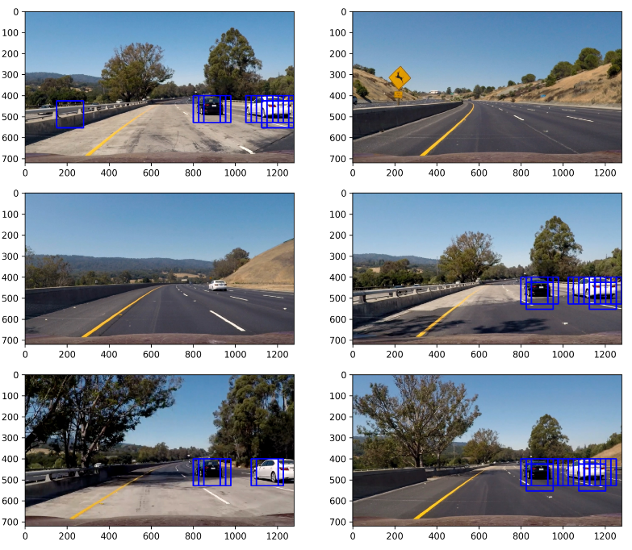

# P5 - Vehicle Detection and Tracking

## Udacity / Self-Driving Car Nanodegree / Term1

In this project, the goal is to write a software pipeline to identify vehicles in a video from a front-facing camera on a car. The test images and project video are available in the project repository. There is an writeup template in the repostitory provided as a starting point for this writeup of the project.

### Vehicle Detection Project

The goals / steps of this project are the following:

* Perform a Histogram of Oriented Gradients (HOG) feature extraction on a labeled training set of images and train a classifier Linear SVM classifier
* Optionally, you can also apply a color transform and append binned color features, as well as histograms of color, to your HOG feature vector.
* Note: for those first two steps don't forget to normalize your features and randomize a selection for training and testing.
* Implement a sliding-window technique and use your trained classifier to search for vehicles in images.
* Run your pipeline on a video stream (start with the test_video.mp4 and later implement on full project_video.mp4) and create a heat map of recurring detections frame by frame to reject outliers and follow detected vehicles.
* Estimate a bounding box for vehicles detected.

## Rubric Points

Here I will consider the rubric points individually and describe how I addressed each point in my implementation.

### Writeup / README

I have provided a writeup/README that serves as rubric points to address each point. Here is a writeup for this project serving as a guide and a starting points.

### Histogram of Oriented Gradients (HOG)

**1. Process of Extracting HOG Features from the Training Images**

The code for this step is contained in the first block to fourth block of the IPython notebook, which is called project_pipeline.ipynb.

I started by reading in all the Vehicle and Non-Vehicle images within the first block of codes. Then I have imported necessary fucntions in second block and contained all utility functions in the third block of codes. 

I then explored different color spaces and different skimage.hog() parameters (orientations, pixels_per_cell, and cells_per_block). I grabbed random images from each of the two classes and displayed them to get a feel for what the skimage.hog() output looks like.

Here is an example using the YCrCb color space and HOG parameters of orientations=6, pixels_per_cell=(8, 8) and cells_per_block=(2, 2) with the random original pictures to their left from Vehicle and Non-Vehicle groups:

**2. Choosing HOG Parameters**

I tried various combinations of parameters and found the set of parameters below worked the best:

* Spatial Color Binning = (32,32)
* Histograms of Color Binning = 32
* Histogram of Oriented Gradient (HOG): orient = 9, pix_per_cell = 8, cell_per_block = 2

Showed in the 5th block, I have used the above parameters to achieve a testing accuracy of 99.02%.

**3. Classifier Training by Selected HOG Features**

I trained a linear SVM using sklearn.svm function, then fitted the 20% testing data to the model. Eventually, under 80 seconds, I have gained a testing accuracy of 99% with feature vector length of 8460.

### Sliding Window Search

**1. Implementation of a Sliding Window Search with Overlap Windows**

In the sixth block of code, I have showed an extraction of features. First, I read the testing images in, and then found windows by function slide_window, last drew windows by function search_windows. The overlap fraction has been chosen at 0.5, which gives me a proper amount of searching windows. Also the searching region on y axis has been limited to 400 to 656 to limit the amount of windows to be generated.

**2. Showcase of Window Search**

Ultimately I searched on RGB 3-channel HOG features plus spatially binned color and histograms of color in the feature vector, which provided a nice result. Here are some example images:

On these test images, you can see clearly that several searching windows have targeted the moving cars.

### Video Implementation

**1. Pipeline should perform reasonably well on the entire project video (somewhat wobbly or unstable bounding boxes are ok as long as you are identifying the vehicles most of the time with minimal false positives.) Here's a link to [my video result](https://github.com/nickli0/Udacity_SDC/blob/master/Projects/P05_Vehicle-Detection-and-Tracking/project_pipeline_video.mp4).**

**2. Implementation of Filter for False Positives and sfor Combining Overlapping Bounding Boxes.**

I recorded the positions of positive detections in each frame of the video. From the positive detections I created a heatmap and then thresholded that map to identify vehicle positions. I then used scipy.ndimage.measurements.label() to identify individual blobs in the heatmap. I then assumed each blob corresponded to a vehicle. I constructed bounding boxes to cover the area of each blob detected.

Here's an example result showing the heatmap from a series of frames of video, the result of scipy.ndimage.measurements.label() and the bounding boxes then overlaid on the last frame of video:

Here are six frames and their corresponding heatmaps without thresholding:

Here are six frames and their corresponding heatmaps with thresholding:

### Discussion

**Problems / issues faced in your implementation of this project. Where will your pipeline likely fail? What could you do to make it more robust?**

The video provided for the project has very clear distinguishment between cars and roads. Pipeline will likely detect pedestrians as car, if the provided video contains multiple non car objects. I also noticed that noisy pixels can also increase the likelihood of model failing. 

To improve the model, the best option is to increase the size of training data for model to distinguish cars from non car objects. Also different color space models can be explored to test for the most optimal parameters for this pipeline to pick up cars more accurate.
